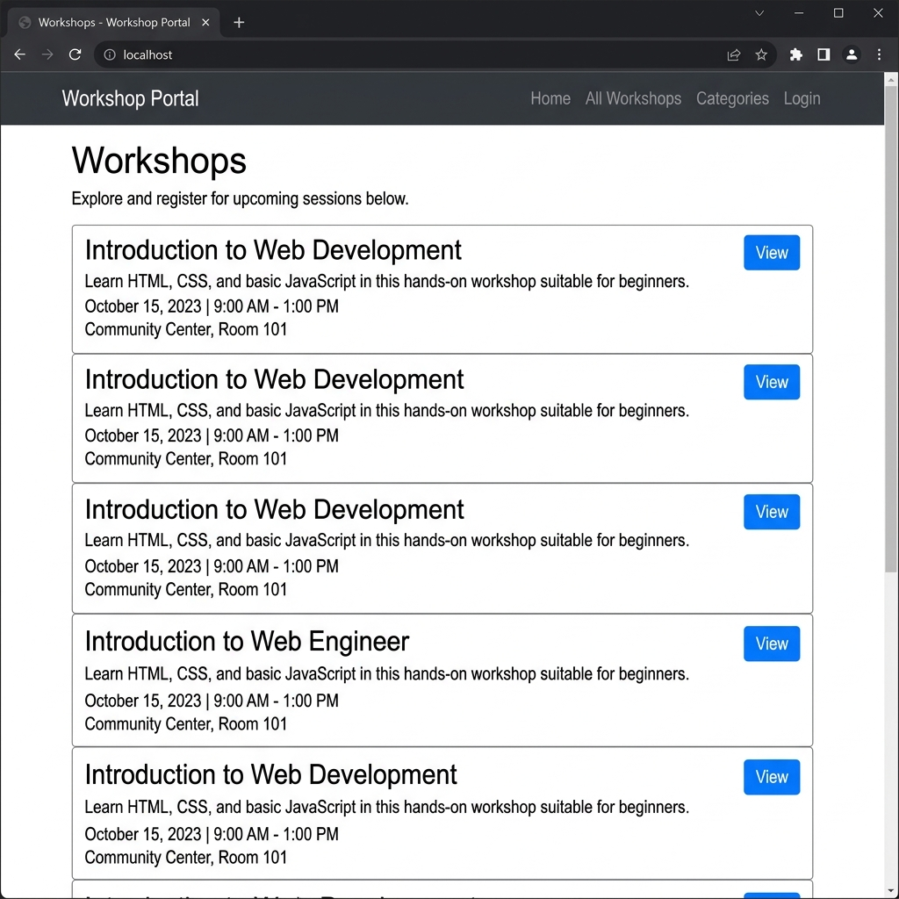
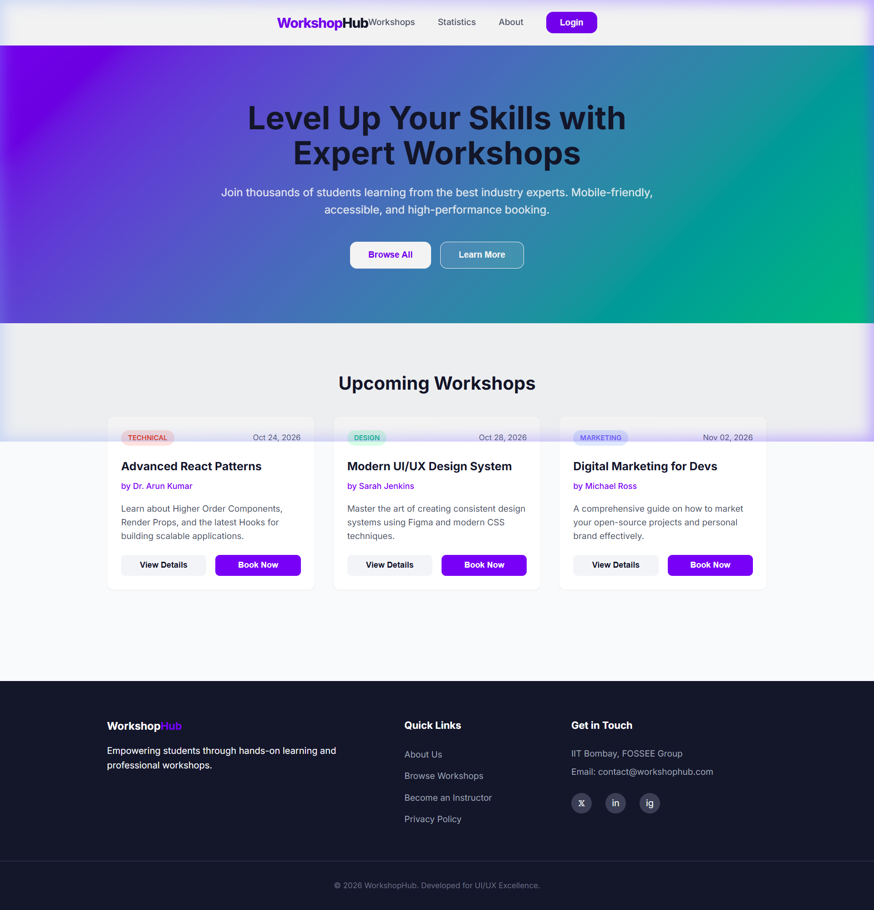
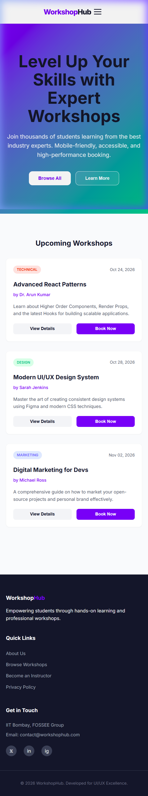

# WorkshopHub | UI/UX Enhancement Project

## Project Overview
This project is a modern, high-performance redesign of the FOSSEE Workshop Booking platform. As a student developer, my goal was to take a functional but basic website and transform it into a premium user experience. I focused on a mobile-first approach, ensuring that students can easily browse and book workshops from any device with speed and accessibility.

---

## Before and After UI

### Original UI (Before)
Our starting point was a functional Django-based site using standard Bootstrap styles. While it worked, it lacked visual depth and modern responsiveness.



### Enhanced UI (After)
The new React-based interface features a vibrant design system, improved visual hierarchy, and smooth interactions.



### Mobile & Navigation
Designed for touch-first interaction with a custom mobile menu and adaptive card grid.



---

## Features & Improvements
- **Modern UI Design**: Clean card-based layout with soft shadows and a professional indigo/emerald color palette.
- **Mobile-First Responsive Layout**: Smooth transitions between mobile, tablet, and desktop views using CSS Grid and Flexbox.
- **Improved Spacing**: Utilized modern whitespace principles to reduce cognitive load.
- **Reusable React Components**: Modular architecture (Navbar, WorkshopCard, Footer) for easy maintenance.
- **Accessibility & SEO**: Semantic HTML tags, ARIA labels for screen readers, and optimized heading hierarchy.
- **Performance**: Integrated **React.lazy** for component lazy loading to ensure fast initial paint times.

---

## Design Principles Used
- **Simplicity**: Removed unnecessary noise to focus on the core user goal (Booking a workshop).
- **Visual Hierarchy**: Used font weights and color accents to guide the eye toward "Book Now" actions.
- **Consistency**: Unified design tokens (radius, shadows, colors) across all components.
- **Accessibility-First**: Ensuring contrast and semantic structure are handled from the start.

---

## Responsiveness Strategy
I used a **Mobile-First** CSS approach, meaning styles were written for small screens first and then scaled up using media queries.
- **Flexbox**: Used for the Navbar and Footer to handle alignment effortlessly.
- **CSS Grid**: Used for the Workshop listing to create a "fluid" grid that stacks vertically on mobile but expands into 3 columns on desktop.
- **Breakpoint**: I chose **768px** as my primary breakpoint to separate mobile/tablet from desktop layouts.

---

## Performance vs. Design Trade-offs
To keep the site lightweight for students on slower mobile connections, I avoided heavy UI libraries like Material UI or Bootstrap. Instead, I wrote **Vanilla CSS**, which significantly reduced the bundle size and allowed for custom micro-animations without adding bloat.

---

## Challenges Faced
- **Responsive Layout**: Ensuring the Workshop cards maintained their readability while shrinking on tablet screens required fine-tuning the `minmax` values in CSS Grid.
- **Clean Structure**: Converting a multi-page Django feel into a sleek single-page React experience while keeping the code beginner-friendly.

---

## Tech Stack
- **React**: Functional components and Hooks (useState).
- **Vanilla CSS**: Custom design system and media queries.
- **Vite**: Modern build tool for fast development.

---

## Project Structure
```text
frontend/
├── public/
├── src/
│   ├── components/
│   │   ├── Navbar/
│   │   ├── Workshops/
│   │   └── Footer/
│   ├── styles/
│   │   └── globals.css
│   └── App.jsx
├── screenshots/
└── README.md
```

---

## Setup Instructions
To run this project locally:

1. Clone the repository.
2. Navigate to the `frontend` folder:
   ```bash
   cd frontend
   ```
3. Install dependencies:
   ```bash
   npm install
   ```
4. Start the development server:
   ```bash
   npm run dev
   ```

---

## Future Improvements
- **Dark Mode**: Implementing a system-wide dark theme.
- **Real Backend Integration**: Connecting to the existing Django API for live data.
- **Enhanced Animations**: Adding Framer Motion for more complex section transitions.
